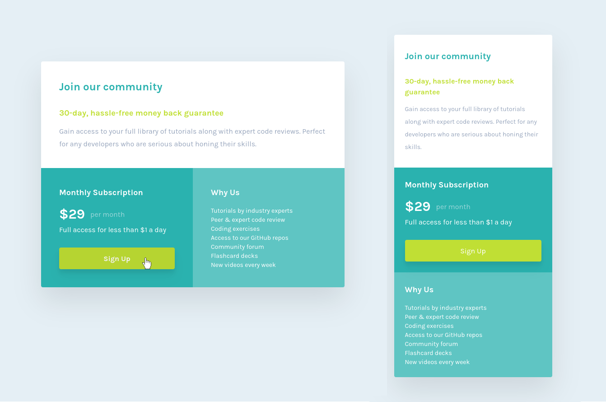

# Frontend Mentor - Single price grid component solution

My solution to the [Single price grid component challenge on Frontend Mentor](https://www.frontendmentor.io/challenges/single-price-grid-component-5ce41129d0ff452fec5abbbc).
Following my [QR Code Component solution](https://github.com/kensparby/fem-qr-code-component) with another practice round of Webpack and Tailwind.

## Table of contents

- [Overview](#overview)
  - [The challenge](#the-challenge)
  - [Screenshot](#screenshot)
  - [Links](#links)
  - [Built with](#built-with)
- [Author](#author)

## Overview

### The challenge

Users should be able to:

- View the optimal layout for the component depending on their device's screen size
- See a hover state on desktop for the Sign Up call-to-action

### Screenshot

### Links

- Solution URL: [Add solution URL here](https://github.com/kensparby/fem-single-price-grid-component)
- Live Site URL: [Add live site URL here](https://kensparby-fem-single-price-component.netlify.app/)

### Built with

- [Tailwind](https://tailwindcss.com/)
- [Webpack](https://webpack.js.org/)
- Love
- Flexbox

## Author

- Website - [https://ken.sparby.dev/](https://ken.sparby.dev/)
- Twitter - [@kensparby](https://www.twitter.com/kensparby)
- Frontend Mentor - [@ksparb](https://www.frontendmentor.io/profile/ksparb)
